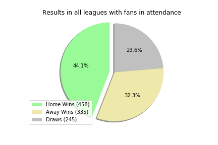

# Web-Design-Challenge

We created visualization dashboard websites using html - the weather data of the cities and the soccer home advantage charts from European Soccer league data.

### Latitude - Latitude Analysis Dashboard with Attitude

* WebVisualizations/
    - start page: landing.html

How is the weather as lattitude is getting zero? Of course, it is getting hot. At zero, is it hottest? Let's see.

### Soccer - Score Analysis Dashboard

* SoccerVisualizations/
    - start page: soccer.html

Do the players perform better at home stadium? Because they are supported by their home team enthuastic fans? How about, after covid-19 pandemic, still are there home advantage without their fans? Check this out the page.

